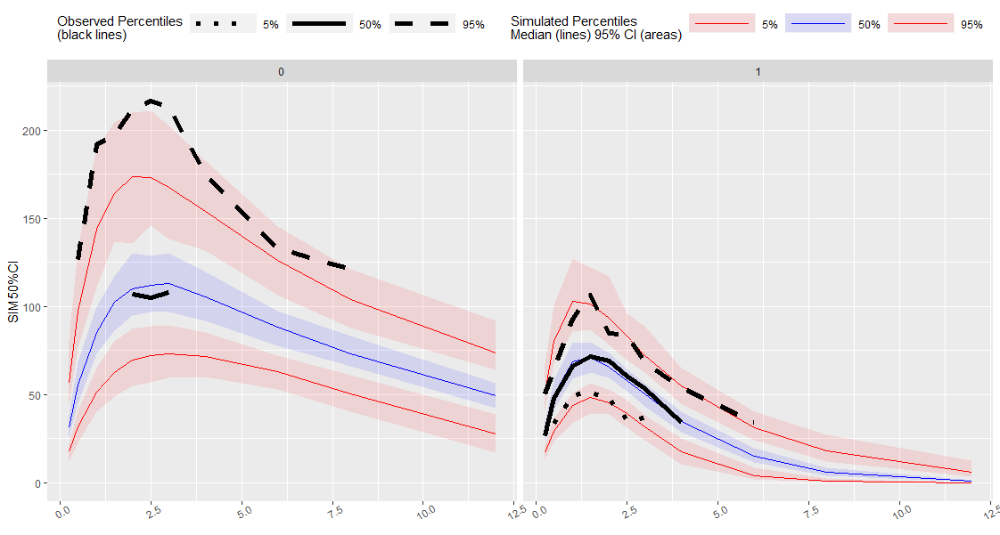

vpcstats
========

[](https://travis-ci.org/smouksassi/ComputePI)

### Installation and Running information
```
# Install the development version from GitHub:
# install.packages("devtools")
devtools::install_github("olivierbarriere/vpcstats")

```

### Usage
```
library(vpc)
library(magrittr)
library(rlang)
library(dplyr)
library(ggplot2)
library(data.table)
library(vpcstats)

exampleobs <- simple_data$obs
exampleobs <- exampleobs[exampleobs$MDV == 0, ]
examplesim <- simple_data$sim
exampleobs$PRED <- examplesim[1:nrow(exampleobs), "PRED"]
exampleobs$REP <- 0
examplesim <- examplesim[examplesim$MDV == 0, ]#
exampleobs$LLOQ <- ifelse(exampleobs$ISM == 0, 100, 25)
examplesim$LLOQ <- ifelse(examplesim$ISM == 0, 100, 25)
VPCDATA<- vpcstats(
  obsdata = exampleobs, simdata = examplesim, stratify = ~ISM,
  NBINS = NULL, LLOQ = LLOQ)

```


Plot Code:

```

ggplot(VPCDATA$PI) +
  facet_grid( ~ ISM) +
  geom_ribbon(
    aes(
      XMED,
      ymin = (`SIM2.5%CI`),
      ymax = (`SIM97.5%CI`),
      fill = QNAME,
      col = QNAME,
      group = QNAME
    ),
    alpha = 0.1,
    col = NA
  ) +
  geom_line(aes(
    XMED,
    y = `SIM50%CI`,
    col = QNAME,
    group = QNAME
  )) +
  geom_line(aes(
    x = XMED,
    y = RAWOBS,
    group = QNAME,
    linetype = QNAME
  ), size = 1) +
  geom_hline(data = VPCDATA$BINS,
             aes(
               yintercept = LLOQ
             ), linetype = "dotted", size = 1) +
  geom_text(data = VPCDATA$BINS %>% distinct(ISM,LLOQ),
             aes(
               x = 10,
               y = LLOQ,
               label = paste("LLOQ", LLOQ, sep=" = "),
             ), vjust = -1)+
  scale_colour_manual(
    name = "Simulated Percentiles\nMedian (lines) 95% CI (areas)",
    breaks = c("5%PI", "50%PI", "95%PI", "Percent BLQ"),
    values = c("red", "blue", "red", "black"),
    labels = c("5%", "50%", "95%", "Percent BLQ")
  ) +
  scale_fill_manual(
    name = "Simulated Percentiles\nMedian (lines) 95% CI (areas)",
    breaks = c("5%PI", "50%PI", "95%PI", "Percent BLQ"),
    values = c("red", "blue", "red", "black"),
    labels = c("5%", "50%", "95%", "Percent BLQ")
  ) +
  scale_linetype_manual(
    name = "Observed Percentiles\n(black lines)",
    breaks = c("5%PI", "50%PI", "95%PI"),
    values = c("dotted", "solid", "dashed"),
    labels = c("5%", "50%", "95%")
  ) +
  guides(
    fill = guide_legend(order = 2),
    colour = guide_legend(order = 2),
    linetype = guide_legend(order = 1)
  ) +
  theme(
    legend.position = "top",
    legend.key.width = grid::unit(2, "cm"),
    axis.text.x = element_text(angle = 30),
    axis.title.x = element_blank()
  )


```
